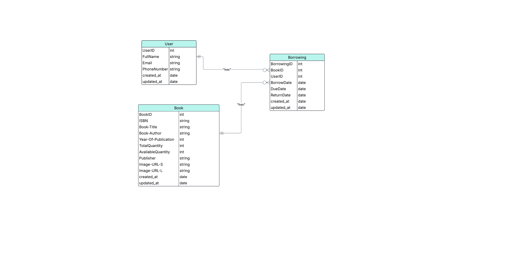

# Sơ đồ ERD 



# Initial DataBase and Import Data

```bash 
python cli.py init_database
python cli.py import_data
```

Hàm đọc dữ liệu từ file csv ở commands/init_database_main.py

# Api Docs 

Api docs ở swagger /docs