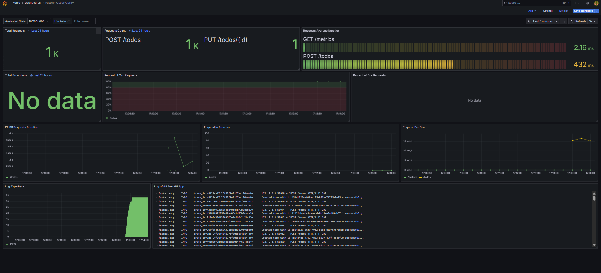
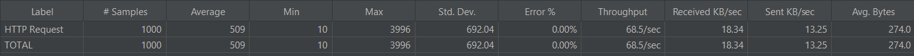
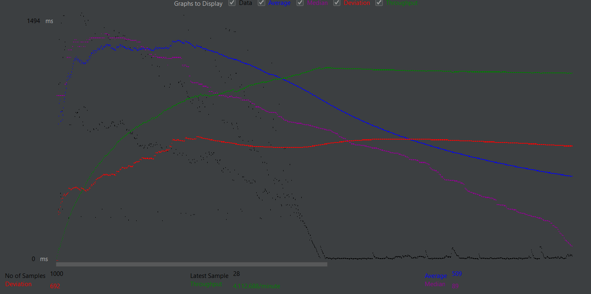

# README

## Quick Start

1. Install [Loki Docker Driver](https://grafana.com/docs/loki/latest/send-data/docker-driver/)

   ```bash
   # For ARM64
   docker plugin install grafana/loki-docker-driver:3.3.2-arm64 --alias loki --grant-all-permissions
   # For AMD64
   docker plugin install grafana/loki-docker-driver:3.3.2-amd64 --alias loki --grant-all-permissions
   ```
2. Start all services with docker-compose

   ```bash
   docker-compose up -d
   ```

   If got the error message `Error response from daemon: error looking up logging plugin loki: plugin loki found but disabled`, please run the following command to enable the plugin:

   ```bash
   docker plugin enable loki
   ```
3. Check predefined dashboard `FastAPI Observability` on Grafana [http://localhost:3000/](http://localhost:3000/) login with `admin:admin`

    Dashboard screenshot:


4. FastAPI documentation is available at [http://localhost:8000/docs](http://localhost:8000/docs)

## Test requests with jmeter 1000 requests
summary results:

summary graph:


## Reference

- [FastAPI Observability](https://github.com/blueswen/fastapi-observability)